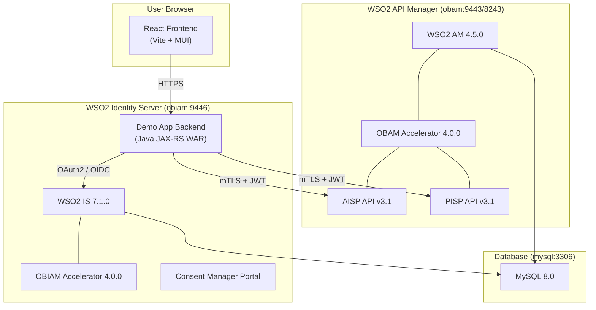

# WSO2 Open Banking Sample Demo Application

A production-ready Third-Party Provider (TPP) demonstrator for the WSO2 Open Banking Sandbox. This application showcases how a TPP front-end interacts with WSO2 Open Banking components to perform account information access (AISP) and payment initiation (PISP) using the UK Open Banking v3.1 specification.

> **Full documentation**: See the [`docs/`](docs/) folder for the [Architecture Overview](docs/ARCHITECTURE.md), [Developer Guide](docs/DEVELOPER_GUIDE.md), [Operations & Troubleshooting Guide](docs/OPERATIONS_GUIDE.md), and [Quick Start Guide](docs/QUICK_START.md).

---

## Table of Contents

1. [Overview](#1-overview)
2. [Repository Clone & Initial Setup](#2-repository-clone--initial-setup)
3. [Prerequisites](#3-prerequisites)
4. [Registry Access & Authentication](#4-registry-access--authentication)
5. [Host File Configuration](#5-host-file-configuration)
6. [Build & Startup Instructions](#6-build--startup-instructions)
7. [Application Access URLs](#7-application-access-urls)
8. [Default User Accounts & Login Credentials](#8-default-user-accounts--login-credentials)
9. [Branding Customization](#9-branding-customization)
10. [Shutdown & Cleanup](#10-shutdown--cleanup)
11. [Useful Docker Commands](#11-useful-docker-commands)
12. [Troubleshooting](#12-troubleshooting)
13. [Verification & Smoke Tests](#13-verification--smoke-tests)
14. [Project Structure Reference](#14-project-structure-reference)
15. [Additional Documentation](#15-additional-documentation)

---

## 1. Overview

### What This Application Does

This demo application acts as a **Third-Party Provider (TPP)** that connects to a WSO2 Open Banking sandbox. It demonstrates:

- **Account Information Access (AISP)** -- Link bank accounts via OAuth consent, view balances, transactions, and standing orders across multiple banks.
- **Payment Initiation (PISP)** -- Create payment consents with bank pre-authorization, submit payment instructions, and track payment status.
- **Consent Lifecycle Management** -- Grant, view, and revoke consents through the Consent Manager portal.
- **Multi-Bank Aggregation** -- Aggregate accounts from multiple banks in a single unified interface.

### Architecture Overview



### Components

| Component | Technology | Purpose |
|-----------|-----------|---------|
| **Frontend** | React 19, Vite, Material-UI 5 | TPP user interface |
| **Backend** | Java 11, JAX-RS (Apache CXF) | API proxy, OAuth orchestration, JWT signing |
| **Identity Server** | WSO2 IS 7.1.0 + OBIAM 4.0.0 | OAuth2/OIDC provider, consent management |
| **API Manager** | WSO2 AM 4.5.0 + OBAM 4.0.0 | Open Banking API gateway (AISP/PISP) |
| **Database** | MySQL 8.0 | Persistence for identity, consent, and API data |
| **Consent Manager** | Built-in (OBIAM) | Admin portal for consent lifecycle management |

### System Dependencies

| Dependency | Version | Required For |
|-----------|---------|-------------|
| Docker | 20.10+ | Container runtime |
| Docker Compose | v2+ | Service orchestration |
| JDK | 11+ | Backend compilation |
| Maven | 3.6+ | Build tool |
| Python | 3.x | HTTP server during Docker build |
| Node.js | 22.12.0 | Frontend build (auto-installed by Maven) |
| pnpm | 9.15.0 | Frontend package manager (auto-installed by Maven) |
| Git | 2.x+ | Source control |

> **Note**: Node.js and pnpm are automatically installed during the Maven build via the `frontend-maven-plugin`. You do not need to install them manually.

---

## 2. Repository Clone & Initial Setup

### Git Prerequisites

- Git 2.x or later installed and configured.
- Access credentials for the repository (SSH key or HTTPS token).

### Clone the Repository

```bash
# HTTPS
git clone <repository-url>

# SSH
git clone git@<host>:<org>/bfsi-samples.git
```

### Navigate to the Project

```bash
cd bfsi-samples/use-case-demos/sample-demo-application
```

### Verify the Clone

Confirm the repository structure is intact:

```bash
ls -la
```

You should see:

```
build.sh
configuration-files/
demo-application/
docker-files/
README.md
docs/
```

### Post-Clone Setup

**1. Make `build.sh` executable (Mac/Linux):**

```bash
chmod +x build.sh
```

> On Windows (Git Bash), the script handles CRLF line ending conversion automatically.

**2. Verify Docker is running:**

```bash
docker --version
docker compose version
```

**3. Verify Java and Maven:**

```bash
java -version    # Should show 11+
mvn -version     # Should show 3.6+
```

**4. Verify Python (required for build):**

```bash
python --version   # or python3 --version
```

> **Important**: The `build.sh` script uses `python -m http.server`. If your system uses `python3` as the default command, see [Python Version Issues](#python-version-issues-in-buildsh) in Troubleshooting.

---

## 3. Prerequisites

### Required Software

| Software | Minimum Version | Installation |
|----------|----------------|-------------|
| **Docker Desktop** | 20.10+ | [docker.com](https://www.docker.com/products/docker-desktop) |
| **Docker Compose** | v2+ (bundled with Docker Desktop) | Included with Docker Desktop |
| **JDK** | 11 | [Adoptium](https://adoptium.net/) or [Oracle JDK](https://www.oracle.com/java/) |
| **Maven** | 3.6+ | [maven.apache.org](https://maven.apache.org/download.cgi) |
| **Python** | 3.x | [python.org](https://www.python.org/downloads/) |
| **Git** | 2.x+ | [git-scm.com](https://git-scm.com/) |

### Platform-Specific Notes

#### macOS

- Install Docker Desktop for Mac.
- JDK 11 via Homebrew: `brew install openjdk@11`
- Maven via Homebrew: `brew install maven`
- Python 3 is pre-installed on modern macOS. If `python` is not available, use `python3` (see [Python Version Issues](#python-version-issues-in-buildsh)).
- Ensure Docker Desktop is started and has sufficient resources allocated (recommended: 8 GB RAM, 4 CPUs).

#### Linux

- Install Docker Engine and Docker Compose plugin.
- Ensure your user is in the `docker` group: `sudo usermod -aG docker $USER`
- JDK 11: `sudo apt install openjdk-11-jdk` (Ubuntu/Debian) or `sudo dnf install java-11-openjdk-devel` (Fedora/RHEL).
- Maven: `sudo apt install maven` or `sudo dnf install maven`.
- Ensure Docker Desktop or Docker Engine is running with sufficient resources.

#### Windows

> **Important**: `build.sh` is a Bash script. On Windows, you **must** use **Git Bash** (installed with Git for Windows) or **WSL2** to run it.

- Install [Docker Desktop for Windows](https://www.docker.com/products/docker-desktop) with WSL2 backend.
- Install [Git for Windows](https://git-scm.com/download/win) (includes Git Bash).
- Install JDK 11 and Maven, and add them to your `PATH`.
- Open **Git Bash** and navigate to the project directory to run `build.sh`.

### Python Version in build.sh

The `build.sh` script starts a temporary HTTP server using:

```bash
python -m http.server 8000
```

If your system only has `python3` available (common on macOS and many Linux distributions), the script will fail. To fix this:

**Option A** -- Create an alias (temporary):
```bash
alias python=python3
```

**Option B** -- Edit `build.sh` line 28:
```bash
# Change:
python -m http.server 8000 &
# To:
python3 -m http.server 8000 &
```

**Option C** -- Install the `python-is-python3` package (Ubuntu/Debian):
```bash
sudo apt install python-is-python3
```

---

## 4. Registry Access & Authentication

### WSO2 Docker Registry Login

The Docker build pulls base images from `registry.wso2.com`. You must authenticate before building.

**Step 1** -- Obtain credentials from your WSO2 account or your organization's WSO2 subscription.

**Step 2** -- Log in to the registry:

```bash
docker login registry.wso2.com
```

Enter your WSO2 credentials when prompted:

```
Username: <your-wso2-email>
Password: <your-wso2-password>
```

**Step 3** -- Verify login:

```bash
docker pull registry.wso2.com/wso2-is/is:7.1.0.0-alpine
```

If this pulls successfully, your authentication is working.

### Images Pulled During Build

The Docker build process pulls these images from `registry.wso2.com`:

| Image | Used By |
|-------|---------|
| `registry.wso2.com/wso2-ob/obiam-accelerator:4.0.0.0-alpine` | WSO2 IS Dockerfile (Stage 1) |
| `registry.wso2.com/wso2-is/is:7.1.0.0-alpine` | WSO2 IS Dockerfile (Stage 2) |
| `registry.wso2.com/wso2-ob/obam-accelerator:4.0.0.0-alpine` | WSO2 AM Dockerfile (Stage 1) |
| `registry.wso2.com/wso2-apim/am:4.5.0.0-alpine` | WSO2 AM Dockerfile (Stage 2) |

> **Note**: The MySQL image (`mysql:8.0`) is pulled from Docker Hub and does not require WSO2 credentials.

### Credential Handling

- Docker stores credentials in `~/.docker/config.json` after a successful login.
- For CI/CD pipelines, use `docker login --username <user> --password-stdin < password-file`.
- Never commit credentials to the repository.

---

## 5. Host File Configuration

The application services use custom hostnames (`obiam` and `obam`) that must resolve to `localhost` on your machine.

### Why This Is Required

The WSO2 Identity Server and API Manager containers are configured with hostnames `obiam` and `obam` respectively. SSL certificates, OAuth redirect URIs, and API base URLs all reference these hostnames. Without host file entries, your browser cannot resolve them.

### Add Host Entries

#### macOS / Linux

```bash
sudo nano /etc/hosts
```

Add these lines at the end of the file:

```
127.0.0.1   obiam
127.0.0.1   obam
```

Save and exit (`Ctrl+O`, `Enter`, `Ctrl+X` in nano).

#### Windows

1. Open **Notepad** as Administrator (right-click > Run as administrator).
2. Open the file: `C:\Windows\System32\drivers\etc\hosts`
3. Add these lines at the end:

```
127.0.0.1   obiam
127.0.0.1   obam
```

4. Save the file.

> **Tip**: On Windows, you may need to disable "Read-only" on the hosts file first, or use PowerShell as Administrator:
> ```powershell
> Add-Content -Path "C:\Windows\System32\drivers\etc\hosts" -Value "`n127.0.0.1   obiam`n127.0.0.1   obam"
> ```

### Verify Host Resolution

```bash
ping obiam
ping obam
```

Both should resolve to `127.0.0.1`:

```
PING obiam (127.0.0.1): 56 data bytes
64 bytes from 127.0.0.1: icmp_seq=0 ttl=64 time=0.042 ms
```

Alternatively:

```bash
nslookup obiam      # Should show 127.0.0.1
curl -k https://obiam:9446    # Should connect (after containers are running)
```

---

## 6. Build & Startup Instructions

### What `build.sh` Does

The `build.sh` script is the **single entry point** for a complete deployment. It performs these steps in order:

1. **Fixes CRLF line endings** on all `.sh` files (Windows Git Bash compatibility).
2. **Starts a temporary HTTP server** on port 8000 to serve configuration files to Docker during build.
3. **Builds the MySQL image** (`ob_database`) from `docker-files/my_sql/`.
4. **Builds the backend WAR** by running `mvn clean package -DskipTests` in `demo-application/`. This also builds the React frontend and bundles it into the WAR.
5. **Copies the WAR** to `configuration-files/api-ob-demo.war`.
6. **Builds the WSO2 IS Docker image** (`wso2is-ob:4.0.0`) with the OBIAM accelerator and demo WAR.
7. **Builds the WSO2 AM Docker image** (`wso2am-ob:4.0.0`) with the OBAM accelerator.
8. **Stops the HTTP server**.
9. **Creates the Docker network** `ob-network` (if it doesn't exist).
10. **Starts Docker Compose** (`docker compose up -d`).
11. **Waits for the OBAM container** to be fully ready (up to 10 minutes).
12. **Streams container logs** to the terminal.

> **Important**: Any code changes to the frontend or backend inside the `demo-application/` folder are automatically rebuilt and packaged into the Docker image when you run `build.sh`. You do not need to manually copy files.

### Running on macOS / Linux

```bash
cd <repository-root>/use-case-demos/sample-demo-application

# Make executable (first time only)
chmod +x build.sh

# Run the full build and deployment
./build.sh
```

### Running on Windows (Git Bash)

```bash
# Open Git Bash, navigate to the project
cd /c/path/to/sample-demo-application

# Run (no chmod needed in Git Bash)
./build.sh
```

> **Note for Windows**: Ensure Docker Desktop is running and configured with the WSL2 backend. The `host.docker.internal` hostname used in the build must resolve correctly.

### Expected Build Output

```
CRLF fix applied to all shell scripts
HTTP server started (PID: 12345) serving: /path/to/sample-demo-application
MySQL build complete
Demo backend WAR build complete
  api-ob-demo.war reachable
IS server build complete
HTTP server stopped
ob-network ensured
Docker compose started
  still waiting... (0s elapsed)
  still waiting... (5s elapsed)
  ...
obam is ready!
──────────────────────────────────────────
All done!
IS Console : https://obiam:9446/console
App URL    : https://obiam:9446/api-ob-demo-1.0.0
──────────────────────────────────────────
```

### Estimated Build Time

| Phase | Approximate Time |
|-------|-----------------|
| Maven + Frontend build | 2-5 minutes |
| Docker image builds | 5-15 minutes (first run, depends on network) |
| Container startup (MySQL) | 1-2 minutes |
| Container startup (OBIAM) | 3-5 minutes |
| Container startup (OBAM) | 3-5 minutes |
| **Total (first run)** | **15-30 minutes** |

Subsequent runs with cached Docker layers are significantly faster.

### Alternative: Manual Start (Images Already Built)

If Docker images are already built from a previous run:

```bash
# Ensure the network exists
docker network create ob-network 2>/dev/null || true

# Start the services
cd docker-files/docker-compose
docker compose up -d

# Follow logs
docker compose logs -f
```

---

## 7. Application Access URLs

After the build completes and all containers are healthy, access these URLs in your browser:

| Application | URL | Purpose |
|------------|-----|---------|
| **Demo App** | [https://obiam:9446/api-ob-demo-1.0.0](https://obiam:9446/api-ob-demo-1.0.0) | Main TPP demo application (account aggregation, payments) |
| **IS Admin Console** | [https://obiam:9446/console](https://obiam:9446/console) | WSO2 Identity Server administration (users, applications, identity providers) |
| **APIM Publisher** | [https://obam:9443/publisher](https://obam:9443/publisher) | WSO2 API Manager publisher portal (manage APIs, subscriptions) |
| **Consent Manager** | [https://obiam:9446/consentmgr](https://obiam:9446/consentmgr) | Consent lifecycle management portal (view, revoke consents) |

> **Browser Certificate Warning**: All endpoints use self-signed SSL certificates. Your browser will show a security warning. Click **Advanced** > **Proceed** (Chrome) or **Accept the Risk** (Firefox) to continue. This is expected in a sandbox environment.

### Endpoint Details

**Demo App** (`/api-ob-demo-1.0.0`)
- The main user-facing application. Users log in to link bank accounts, view transactions, make payments, and manage standing orders across multiple banks.

**IS Admin Console** (`/console`)
- Administrative interface for the WSO2 Identity Server. Manage users, service providers, OAuth applications, and identity configurations.

**APIM Publisher** (`/publisher`)
- Manage Open Banking APIs. View deployed AISP/PISP APIs, configure rate limiting, and manage API subscriptions.

**Consent Manager** (`/consentmgr`)
- View and manage all consents granted by users. Bank administrators can audit, search, and revoke consents.

---

## 8. Default User Accounts & Login Credentials

### Demo Application User

| Field | Value |
|-------|-------|
| Username | `psu@gold.com` |
| Password | `Wso21234` |
| Used At | [Demo App](https://obiam:9446/api-ob-demo-1.0.0) |
| Role | Payment Service User (PSU) -- end-user interacting with the TPP application |

### IS Admin Console

| Field | Value |
|-------|-------|
| Username | `is_admin@wso2.com` |
| Password | `wso2123` |
| Used At | [IS Console](https://obiam:9446/console) |
| Role | Identity Server super administrator |

### APIM Admin Console

| Field | Value |
|-------|-------|
| Username | `am_admin@wso2.com` |
| Password | `wso2123` |
| Used At | [APIM Publisher](https://obam:9443/publisher) |
| Role | API Manager super administrator |

### Consent Manager Admin

| Field | Value |
|-------|-------|
| Username | `ann@gold.com` |
| Password | `Ann@1234` |
| Used At | [Consent Manager](https://obiam:9446/consentmgr) |
| Role | Bank administrator for consent lifecycle management |

### Consent Manager User

| Field | Value |
|-------|-------|
| Username | `psu@gold.com` |
| Password | `Wso21234` |
| Used At | [Consent Manager](https://obiam:9446/consentmgr) |
| Role | End-user viewing their own consent records |

> **Note**: Admin passwords (`wso2123`) are configured in `configuration-files/obiam-deployment.toml` and `configuration-files/obam-deployment.toml`. Change them by editing the `password` field under `[super_admin]` in the respective files and rebuilding.

---

## 9. Branding Customization

### Changing Bank Names and Logos

The demo application comes pre-configured with three sample banks: **Ascend Global Bank**, **Global Asset Trust**, and **Trust Union**. You can rebrand these to match your organization.

#### Step 1: Replace Logo Images

Copy your new logo images into:

```
demo-application/components/ob_demo_application/frontend/public/resources/assets/images/logos/
```

**Important**: Rename your new images to match the existing filenames the application expects:

| Current Filename | Bank |
|-----------------|------|
| `assend_global_bank_logo.png` | Bank 1 |
| `global_asset_trust_logo.png` | Bank 2 |
| `trust_union_logo.png` | Bank 3 |

#### Step 2: Update Bank Configuration

Edit the configuration file:

```
demo-application/components/ob_demo_application/frontend/public/configurations/config.json
```

Update the relevant fields for each bank in the `banks` array:

```json
{
  "name": "Your Bank Name",
  "image": "./resources/assets/images/logos/assend_global_bank_logo.png",
  "currency": "USD",
  "color": "#003366",
  "border": "#003366"
}
```

#### Step 3: Update Application Name (Optional)

In the same `config.json` file, update the app identity:

```json
{
  "name": {
    "route": "accounts-central",
    "applicationName": "Your Application Name"
  }
}
```

#### Step 4: Rebuild

After making branding changes, rebuild the application:

```bash
# Full rebuild (recommended)
./build.sh

# Or, rebuild only the WAR and redeploy manually
cd demo-application
mvn clean package -DskipTests
```

> **Note**: The `build.sh` script automatically rebuilds the frontend, packages it into the WAR, builds new Docker images, and redeploys -- so branding changes are picked up automatically.

### Changing Background and Profile Images

| Image | Path |
|-------|------|
| Dashboard background | `frontend/public/resources/assets/images/background/bg-image.webp` |
| User profile picture | `frontend/public/resources/assets/images/profile/dp_image.webp` |

Replace these files with your own images using the same filenames and formats.

### Changing Color Schemes

Colors are configured in `config.json` under the `colors` array:

```json
"colors": [
    {"primary": "#FF5100"},
    {"secondaryColor": "#EAA340"},
    {"backgroundColor": "#FFF5EE"},
    {"button": "#FFFFFF"}
]
```

Modify these hex values to match your brand palette, then rebuild.

---

## 10. Shutdown & Cleanup

### Stop All Services

```bash
cd docker-files/docker-compose
docker compose down
```

This stops and removes all containers but **preserves the MySQL data volume**.

### Stop and Remove All Data

```bash
cd docker-files/docker-compose
docker compose down -v
```

> **Warning**: The `-v` flag removes all Docker volumes, including `mysql_data`. This permanently deletes all database state (users, consents, API configurations). You will need to run `build.sh` again to reinitialize the database.

### Remove Docker Images

To free disk space by removing the built images:

```bash
docker rmi ob_database wso2is-ob:4.0.0 wso2am-ob:4.0.0
```

### Remove the Docker Network

```bash
docker network rm ob-network
```

### Full Reset (Nuclear Option)

To completely clean up everything and start fresh:

```bash
cd docker-files/docker-compose
docker compose down -v
docker rmi ob_database wso2is-ob:4.0.0 wso2am-ob:4.0.0
docker network rm ob-network
```

Then re-run `./build.sh` for a clean deployment.

---

## 11. Useful Docker Commands

### Container Status

```bash
# List running containers
docker ps

# List all containers (including stopped)
docker ps -a

# Check container health status
docker inspect --format='{{.State.Health.Status}}' obiam
docker inspect --format='{{.State.Health.Status}}' obam
```

### Logs

```bash
# View logs for a specific container
docker logs obiam
docker logs obam
docker logs <mysql-container-name>

# Follow logs in real time
docker logs -f obiam

# Show last 100 lines
docker logs --tail 100 obam
```

### Container Management

```bash
# Restart a specific container
docker restart obiam

# Stop a container
docker stop obam

# Start a stopped container
docker start obiam

# Execute a command inside a running container
docker exec -it obiam bash
docker exec -it obam bash
```

### Docker Compose Commands

```bash
# Start services in detached mode
cd docker-files/docker-compose
docker compose up -d

# Stop and remove containers (preserve volumes)
docker compose down

# Stop and remove containers and volumes
docker compose down -v

# View running compose services
docker compose ps

# Rebuild and restart a single service
docker compose up -d --build obiam
```

### Disk & Image Management

```bash
# List all Docker images
docker images

# Remove unused images, containers, networks
docker system prune

# Remove all unused data (including volumes) - DESTRUCTIVE
docker system prune -a --volumes
```

---

## 12. Troubleshooting

### Registry Login Failures

**Symptom**: `docker build` fails with `unauthorized` or `authentication required`.

**Fix**:
```bash
docker logout registry.wso2.com
docker login registry.wso2.com
# Enter valid WSO2 credentials
```

Verify with:
```bash
docker pull registry.wso2.com/wso2-is/is:7.1.0.0-alpine
```

### Python Version Issues in build.sh

**Symptom**: `python: command not found` or `No module named http.server`.

**Fix**: The script uses `python -m http.server`. If only `python3` is available:

```bash
# Option 1: Create alias before running build
alias python=python3
./build.sh

# Option 2: Edit build.sh line 28
# Change: python -m http.server 8000 &
# To:     python3 -m http.server 8000 &

# Option 3 (Ubuntu/Debian): Install symlink package
sudo apt install python-is-python3
```

### Host Mapping Issues

**Symptom**: Browser shows `ERR_NAME_NOT_RESOLVED` for `https://obiam:9446`.

**Fix**: Verify host entries:
```bash
cat /etc/hosts | grep -E "obiam|obam"
```

Expected:
```
127.0.0.1   obiam
127.0.0.1   obam
```

If entries exist but still fail:
```bash
# macOS: Flush DNS cache
sudo dscacheutil -flushcache; sudo killall -HUP mDNSResponder

# Linux: Restart systemd-resolved
sudo systemctl restart systemd-resolved

# Windows (in admin cmd): Flush DNS cache
ipconfig /flushdns
```

### Certificate / Browser Trust Issues

**Symptom**: Browser shows `NET::ERR_CERT_AUTHORITY_INVALID` or refuses to connect.

**Fix**: This is expected with self-signed certificates.
- **Chrome**: Click "Advanced" > "Proceed to obiam:9446 (unsafe)"
- **Firefox**: Click "Advanced" > "Accept the Risk and Continue"
- **Safari**: Click "Show Details" > "visit this website"
- **Edge**: Click "Advanced" > "Continue to obiam:9446 (unsafe)"

For `curl` commands, use the `-k` flag to skip certificate verification:
```bash
curl -k https://obiam:9446/carbon/admin/login.jsp
```

### Container Startup Failures

**Symptom**: Containers exit immediately or health checks fail.

**Diagnosis**:
```bash
# Check container status
docker ps -a

# Check logs for errors
docker logs obiam 2>&1 | tail -50
docker logs obam 2>&1 | tail -50

# Check if MySQL is healthy first (other services depend on it)
docker inspect --format='{{.State.Health.Status}}' $(docker ps -q --filter ancestor=ob_database)
```

**Common causes**:
- MySQL not ready yet (other services depend on it; check health status).
- Insufficient Docker memory (increase to 8 GB+ in Docker Desktop settings).
- Previous containers on same ports still running.

### Port Conflicts

**Symptom**: `Bind for 0.0.0.0:9446 failed: port is already allocated`.

**Fix**:
```bash
# Find what's using the port
lsof -i :9446   # macOS/Linux
netstat -ano | findstr :9446   # Windows

# Kill the conflicting process or stop the other container
docker stop <conflicting-container>
```

Ports used by this project: `3306`, `8000` (during build only), `8243`, `8280`, `9443`, `9446`.

### Permission Issues

**Symptom**: `Permission denied` when running `build.sh`.

**Fix**:
```bash
chmod +x build.sh
chmod +x docker-files/docker-compose/wait-for-it.sh
```

### Build Failures

**Symptom**: Maven build fails during `mvn clean package`.

**Common fixes**:
```bash
# Clear Maven cache
rm -rf ~/.m2/repository

# Ensure JDK 11 is active
java -version   # Should show 11.x

# Run with debug output
cd demo-application
mvn clean package -DskipTests -X
```

**Symptom**: Frontend build fails during Maven execution.

**Fix**: The Maven build auto-installs Node.js and pnpm. If it fails:
```bash
# Clear frontend node_modules
rm -rf demo-application/components/ob_demo_application/frontend/node_modules

# Re-run
cd demo-application
mvn clean package -DskipTests
```

### HTTP Server Port 8000 Already In Use

**Symptom**: `build.sh` fails because port 8000 is occupied.

**Fix**: The script attempts to kill existing processes on port 8000. If it persists:
```bash
lsof -ti:8000 | xargs kill -9
./build.sh
```

### Docker Network Issues

**Symptom**: `network ob-network declared as external, but could not be found`.

**Fix**:
```bash
docker network create ob-network
```

---

## 13. Verification & Smoke Tests

After deployment, run through this checklist to confirm everything is working.

### Infrastructure Checks

- [ ] **All containers are running**:
  ```bash
  docker ps --format "table {{.Names}}\t{{.Status}}\t{{.Ports}}"
  ```
  Verify `mysql`, `obiam`, and `obam` are all `Up` and `(healthy)`.

- [ ] **MySQL is accepting connections**:
  ```bash
  docker exec -it $(docker ps -q --filter ancestor=ob_database) mysqladmin ping -u wso2 -pwso2
  ```
  Expected: `mysqld is alive`.

- [ ] **OBIAM is responding**:
  ```bash
  curl -k -s -o /dev/null -w "%{http_code}" https://obiam:9446/carbon/admin/login.jsp
  ```
  Expected: `200`.

- [ ] **OBAM is responding**:
  ```bash
  curl -k -s -o /dev/null -w "%{http_code}" https://obam:9443/carbon/admin/login.jsp
  ```
  Expected: `200`.

### Application Checks

- [ ] **Demo App loads**: Open [https://obiam:9446/api-ob-demo-1.0.0](https://obiam:9446/api-ob-demo-1.0.0) in your browser. Accept the certificate warning. You should see the login/home page.

- [ ] **IS Console loads**: Open [https://obiam:9446/console](https://obiam:9446/console). Log in with `is_admin@wso2.com` / `wso2123`.

- [ ] **APIM Publisher loads**: Open [https://obam:9443/publisher](https://obam:9443/publisher). Log in with `am_admin@wso2.com` / `wso2123`.

- [ ] **Consent Manager loads**: Open [https://obiam:9446/consentmgr](https://obiam:9446/consentmgr). Log in with `ann@gold.com` / `Ann@1234`.

### Functional Checks

- [ ] **Account Linking Flow**: In the Demo App, log in as `psu@gold.com` / `Wso21234`, then attempt to add/link a bank account. The OAuth consent flow should redirect you through the IS for authorization.

- [ ] **Payment Flow**: In the Demo App, initiate a payment. The PISP consent flow should redirect you through the IS for payment authorization.

- [ ] **Consent Revocation**: After linking an account, attempt to revoke the consent from the Demo App or the Consent Manager portal.

---

## 14. Project Structure Reference

```
sample-demo-application/
├── README.md                              # This file
├── build.sh                               # Master build & deploy script
├── docs/                                  # Detailed documentation
│   ├── ARCHITECTURE.md                    # System architecture deep dive
│   ├── DEVELOPER_GUIDE.md                 # Developer workflows & customization
│   ├── OPERATIONS_GUIDE.md                # Operations, Docker, troubleshooting
│   └── QUICK_START.md                     # 5-minute quick start
│
├── configuration-files/                   # Deployment overrides & artifacts
│   ├── obiam-deployment.toml              # WSO2 IS configuration
│   ├── obam-deployment.toml               # WSO2 AM configuration
│   ├── customErrorFormatter.xml           # API error formatting
│   ├── mysql-connector-java-5.1.44.jar    # MySQL JDBC driver
│   ├── api#fs#backend.war                 # Accelerator backend WAR
│   ├── trust_certs.zip                    # Root & issuer certificates
│   └── keystores/                         # WSO2 server keystores
│       ├── private-keys.jks
│       └── public-certs.jks
│
├── demo-application/                      # Application source code
│   ├── pom.xml                            # Maven parent POM
│   └── components/ob_demo_application/
│       ├── frontend/                      # React + Vite frontend
│       │   ├── package.json
│       │   ├── vite.config.ts
│       │   ├── public/                    # Static assets & config
│       │   │   ├── configurations/config.json
│       │   │   └── resources/assets/images/
│       │   └── src/                       # React source code
│       │       ├── pages/                 # Page components
│       │       ├── components/            # Reusable UI components
│       │       ├── hooks/                 # Custom React hooks
│       │       ├── layouts/               # Page layouts
│       │       └── utility/               # API client & helpers
│       └── src/main/                      # Java backend
│           ├── java/com/wso2/openbanking/demo/
│           │   ├── controller/            # REST API endpoints
│           │   ├── service/               # Business logic & OAuth
│           │   ├── models/                # Data models
│           │   ├── security/              # CORS & security filters
│           │   └── http/                  # HTTP & TLS clients
│           ├── resources/                 # Backend config & certs
│           └── webapp/WEB-INF/            # Web deployment descriptor
│
└── docker-files/                          # Docker orchestration
    ├── my_sql/Dockerfile                  # MySQL with seed data
    ├── wso2is_with_obiam/Dockerfile       # WSO2 IS + OBIAM accelerator
    ├── wso2am_with_obam/Dockerfile        # WSO2 AM + OBAM accelerator
    └── docker-compose/
        ├── docker-compose.yml             # Service definitions
        └── wait-for-it.sh                 # Health check utility
```

---

## 15. Additional Documentation

| Document | Description |
|----------|------------|
| [Architecture Overview](docs/ARCHITECTURE.md) | Detailed system architecture, component interactions, data flows, and Mermaid diagrams |
| [Developer Guide](docs/DEVELOPER_GUIDE.md) | Frontend & backend development workflows, branding, configuration reference |
| [Operations & Troubleshooting Guide](docs/OPERATIONS_GUIDE.md) | Complete Docker operations, monitoring, debugging, and recovery procedures |
| [Quick Start Guide](docs/QUICK_START.md) | Condensed setup for experienced developers -- get running in 5 minutes |

---

## License

Copyright (c) 2025, WSO2 LLC. All Rights Reserved.

This software is the property of WSO2 LLC. and its suppliers. Dissemination of any information or reproduction of any material contained herein is strictly forbidden, unless permitted by WSO2 expressly.
