# Architecture Overview

A detailed technical reference for the WSO2 Open Banking Sample Demo Application architecture, component interactions, data flows, and security model.

---

## Table of Contents

1. [System Architecture](#1-system-architecture)
2. [Component Details](#2-component-details)
3. [Data Flow Diagrams](#3-data-flow-diagrams)
4. [Network Architecture](#4-network-architecture)
5. [Security Architecture](#5-security-architecture)
6. [Database Architecture](#6-database-architecture)
7. [API Specifications](#7-api-specifications)
8. [Frontend Architecture](#8-frontend-architecture)
9. [Backend Architecture](#9-backend-architecture)
10. [Build Pipeline](#10-build-pipeline)

---

## 1. System Architecture

### High-Level Architecture

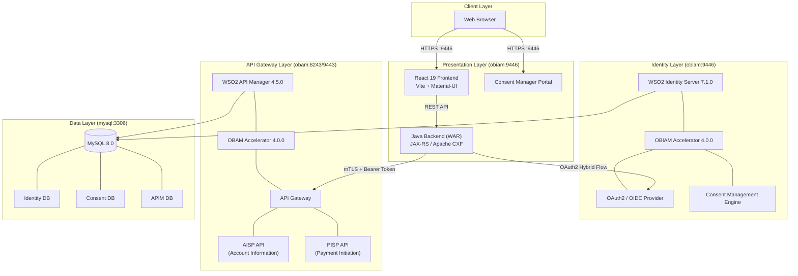

### Component Interaction Summary

The system follows a **TPP (Third-Party Provider)** architecture pattern where:

1. The **React frontend** serves as the user-facing TPP application.
2. The **Java backend** acts as a confidential OAuth2 client, managing token exchange, JWT signing, and API calls on behalf of the user.
3. The **WSO2 Identity Server** with the OBIAM accelerator handles OAuth2/OIDC authorization, consent management, and user authentication.
4. The **WSO2 API Manager** with the OBAM accelerator exposes the Open Banking APIs (AISP/PISP) and enforces security policies.
5. **MySQL** provides persistence for identity data, consent records, and API management state.

---

## 2. Component Details

### React Frontend

| Property | Value |
|----------|-------|
| Framework | React 19.2.0 |
| Build Tool | Vite 5.4.0 |
| UI Library | Material-UI (MUI) 5.18.0 |
| Authentication | Asgardeo Auth React 5.6.0 |
| State Management | TanStack React Query 5.90.7 |
| Routing | React Router DOM 7.9.5 |
| Charts | Chart.js 4.5.1 |
| Package Manager | pnpm 9.15.0 |
| Node.js | 22.12.0 |

**Responsibilities**:
- Render multi-bank account dashboard with balances, transactions, and standing orders.
- Handle OAuth2 redirect flows for account linking and payment consent.
- Provide payment initiation forms.
- Display data from `config.json` (sample bank data) and live API responses.

### Java Backend (WAR)

| Property | Value |
|----------|-------|
| Language | Java 11 |
| Framework | JAX-RS (Apache CXF 3.5.9) |
| HTTP Client | Apache HttpComponents 4.5.13 |
| JSON Processing | Jackson 2.15.2 |
| JWT Signing | PS256 (custom implementation) |
| Build Tool | Maven |
| Artifact | `api-ob-demo-1.0.0.war` |

**Responsibilities**:
- Serve as the OAuth2 confidential client for the TPP.
- Build JWT request objects and client assertions (PS256).
- Handle OAuth2 authorization code exchange.
- Proxy AISP/PISP API calls to the API Manager via mTLS.
- Manage consent state and flow tracking.

### WSO2 Identity Server (OBIAM)

| Property | Value |
|----------|-------|
| Product | WSO2 IS 7.1.0 |
| Accelerator | OBIAM 4.0.0 |
| Container | `obiam` |
| Port | 9446 (HTTPS) |
| Base Image | `registry.wso2.com/wso2-is/is:7.1.0.0-alpine` |

**Responsibilities**:
- OAuth2 / OpenID Connect provider.
- Consent management lifecycle (create, authorize, revoke).
- User authentication and session management.
- Dynamic Client Registration (DCR).
- Host the demo application WAR and Consent Manager portal.

### WSO2 API Manager (OBAM)

| Property | Value |
|----------|-------|
| Product | WSO2 AM 4.5.0 |
| Accelerator | OBAM 4.0.0 |
| Container | `obam` |
| Ports | 9443 (Admin), 8243 (HTTPS Gateway), 8280 (HTTP Gateway) |
| Base Image | `registry.wso2.com/wso2-apim/am:4.5.0.0-alpine` |

**Responsibilities**:
- API Gateway for Open Banking AISP/PISP endpoints.
- Token validation and scope enforcement.
- Rate limiting and throttling.
- CORS handling via custom error formatter.
- API lifecycle management (publish, subscribe, deprecate).

### MySQL Database

| Property | Value |
|----------|-------|
| Version | 8.0 |
| Container Image | `ob_database` (custom) |
| Port | 3306 |
| Root Password | `root` |
| App User | `wso2` / `wso2` |
| Volume | `mysql_data` (persistent) |

---

## 3. Data Flow Diagrams

### Account Linking Flow (AISP)

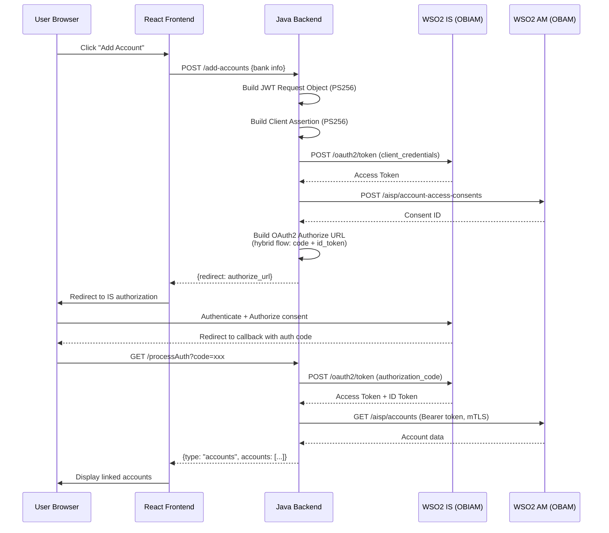

### Payment Initiation Flow (PISP)

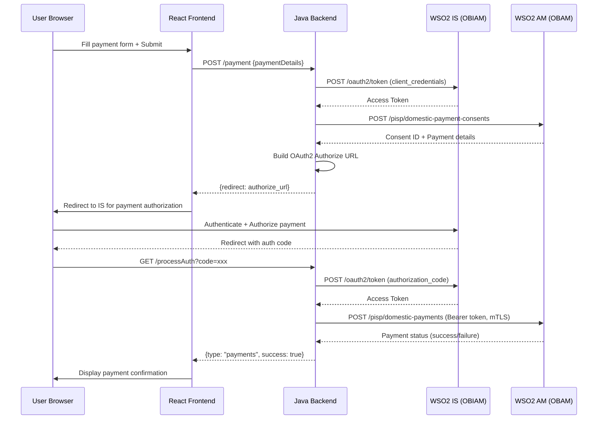

### Consent Revocation Flow

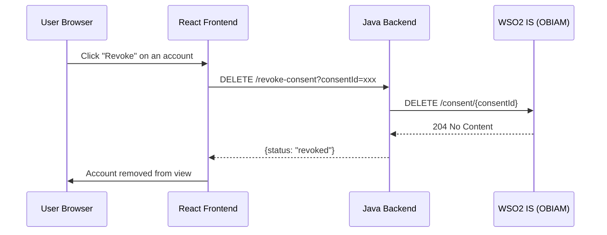

---

## 4. Network Architecture

### Docker Network Topology

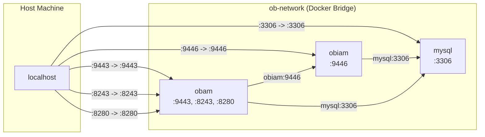

### Port Mapping

| Host Port | Container | Container Port | Protocol | Purpose |
|-----------|-----------|---------------|----------|---------|
| 3306 | mysql | 3306 | TCP | MySQL database |
| 9446 | obiam | 9446 | HTTPS | IS console, Demo App, Consent Manager |
| 9443 | obam | 9443 | HTTPS | AM admin console, Publisher |
| 8243 | obam | 8243 | HTTPS | API Gateway (data plane) |
| 8280 | obam | 8280 | HTTP | API Gateway (HTTP pass-through) |

### DNS Resolution

- **Inside Docker**: Containers resolve each other by service name (`mysql`, `obiam`, `obam`) via Docker's embedded DNS.
- **Host Machine**: The host resolves `obiam` and `obam` via `/etc/hosts` entries pointing to `127.0.0.1`.

### External Network

The Docker Compose configuration uses an **external network** named `ob-network`. This must be created before running `docker compose up`:

```bash
docker network create ob-network
```

The `build.sh` script creates this network automatically.

---

## 5. Security Architecture

### Authentication & Authorization

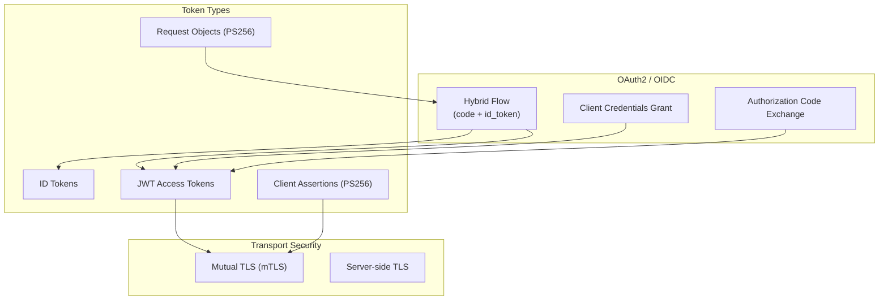

### Security Layers

| Layer | Mechanism | Details |
|-------|-----------|---------|
| **Transport** | TLS 1.2+ | All communication over HTTPS with self-signed certificates |
| **Client Authentication** | mTLS + PS256 JWT | Backend authenticates to OBAM using client certificates and signed JWTs |
| **User Authentication** | OAuth2 Hybrid Flow | Users authenticate via IS login page with redirect-based flow |
| **Token Format** | JWT (self-contained) | Access tokens are PS256-signed JWTs containing claims and scopes |
| **Consent** | FAPI-compliant | Consent scopes: `accounts`, `payments`, `fundsconfirmations` |
| **API Security** | Bearer Token + mTLS | API calls require both a valid Bearer token and client certificate |

### Certificate Inventory

| Certificate | Location | Purpose |
|------------|----------|---------|
| `obtransport.pem` / `obtransport.key` | Backend resources | Client certificate for mTLS with OBAM |
| `obsigning.key` | Backend resources | Private key for JWT signing (PS256) |
| `private-keys.jks` | `configuration-files/keystores/` | WSO2 server private keys (aliases: wso2carbon-obiam, wso2carbon-obam) |
| `public-certs.jks` | `configuration-files/keystores/` | WSO2 server public certificates |
| `trust_certs.zip` | `configuration-files/` | Root and issuer CA certificates |
| `client-truststore.jks` | Inside containers | Combined truststore with all CA and server certificates |

### OAuth2 Configuration

| Parameter | Value |
|-----------|-------|
| Client ID | `6LU91CbY4QsoPhpnW1hySYOfipQa` |
| Algorithm | PS256 |
| Response Type | `code id_token` (Hybrid Flow) |
| Token Type | JWT (self-contained) |
| Token Endpoint | `https://obiam:9446/oauth2/token` |
| Authorize Endpoint | `https://obiam:9446/oauth2/authorize` |
| Redirect URI | `https://obiam:9446/api-ob-demo-1.0.0/callback` |
| FAPI Financial ID | `open-bank` |

---

## 6. Database Architecture

### Schema Layout

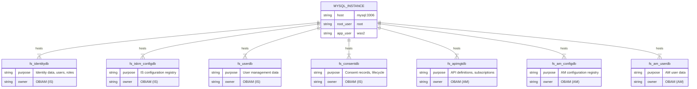

### Database Credentials

| User | Password | Databases | Purpose |
|------|----------|-----------|---------|
| `root` | `root` | All | MySQL superuser |
| `wso2` | `wso2` | `fs_*` schemas | Application user for WSO2 products |

### Persistence

- Data is stored in the Docker volume `mysql_data`.
- Running `docker compose down` preserves the volume.
- Running `docker compose down -v` **destroys** all data.
- The database is initialized from SQL dump files (`ob_dump21.sql`, `grants.sql`) during first container start.

---

## 7. API Specifications

### Backend REST Endpoints (Demo App)

The Java backend exposes these REST endpoints under the WAR context path `/api-ob-demo-1.0.0`:

| Method | Path | Request | Response | Purpose |
|--------|------|---------|----------|---------|
| `POST` | `/add-accounts` | `Map<String, String>` (bank info) | `{redirect: "<url>"}` | Initiate account linking OAuth flow |
| `POST` | `/payment` | `Payment` object (payee, amount, etc.) | `{redirect: "<url>"}` | Initiate payment OAuth flow |
| `GET` | `/processAuth` | Query: `code` (OAuth auth code) | Accounts or Payment result JSON | Handle OAuth callback, exchange token |
| `DELETE` | `/revoke-consent` | Query: `accountId`, `bankName`, `consentId` | `{status: "revoked"}` | Revoke an account access consent |

### Open Banking APIs Consumed (via OBAM Gateway)

#### AISP - Account Information (v3.1)

| Method | Path | Purpose |
|--------|------|---------|
| `POST` | `/open-banking/v3.1/aisp/account-access-consents` | Create account access consent |
| `GET` | `/open-banking/v3.1/aisp/accounts` | List linked accounts |
| `GET` | `/open-banking/v3.1/aisp/accounts/{id}` | Account details |
| `GET` | `/open-banking/v3.1/aisp/accounts/{id}/balances` | Account balance |
| `GET` | `/open-banking/v3.1/aisp/accounts/{id}/transactions` | Transaction history |

#### PISP - Payment Initiation (v3.1)

| Method | Path | Purpose |
|--------|------|---------|
| `POST` | `/open-banking/v3.1/pisp/domestic-payment-consents` | Create payment consent |
| `POST` | `/open-banking/v3.1/pisp/domestic-payments` | Submit payment |
| `GET` | `/open-banking/v3.1/pisp/domestic-payments/{id}` | Payment status |

---

## 8. Frontend Architecture

### Component Tree

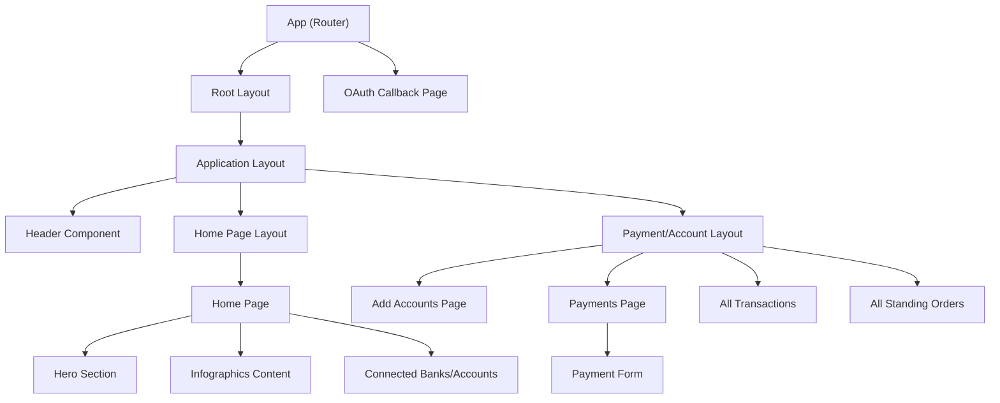

### Route Map

| Route | Component | Layout | Purpose |
|-------|-----------|--------|---------|
| `/` | Redirect | -- | Redirects to `/{appRoute}` |
| `/{route}` | `HomePage` | `HomePageLayout` | Main dashboard |
| `/{route}/accounts` | `AddAccountsPage` | `PaymentAccountLayout` | Link new accounts |
| `/{route}/paybills` | `PaymentsPage` | `PaymentAccountLayout` | Make payments |
| `/{route}/transactions` | `AllTransactions` | `PaymentAccountLayout` | Transaction history |
| `/{route}/standing-orders` | `AllStandingOrders` | `PaymentAccountLayout` | Standing orders list |
| `/callback` | `OAuthCallbackPage` | -- | OAuth2 redirect handler |

### State Management

- **React Query (TanStack Query)**: Server state, API caching, refetching.
- **React Context**: Application configuration (`useConfigContext`), theme provider.
- **Asgardeo Auth**: Authentication state, tokens, user session.
- **Local State**: Form inputs, UI toggle states.

### Configuration System

The frontend loads configuration from `public/configurations/config.json` at runtime via the `useConfig` hook. This file defines:

- User profile (name, avatar)
- Application name and route
- Bank definitions (names, logos, colors, accounts, transactions)
- Payee list
- Use case flow definitions
- Table header configurations
- Color themes

---

## 9. Backend Architecture

### Service Layer Design

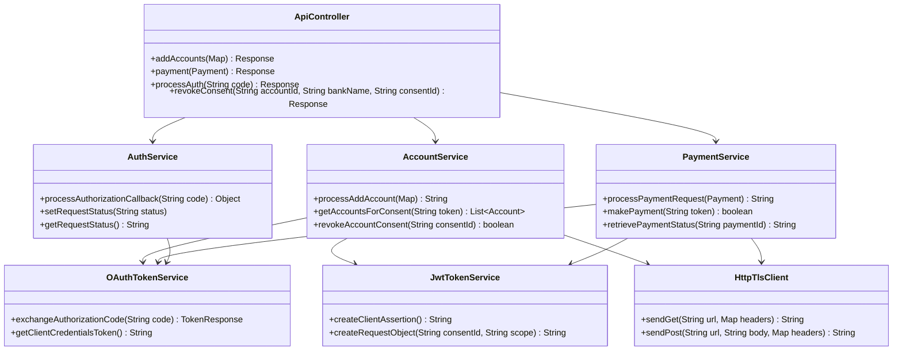

### Key Backend Configuration

All backend configuration is in `src/main/resources/application.properties`:

| Property | Value | Purpose |
|----------|-------|---------|
| `is.base.url` | `https://obiam:9446` | Identity Server base URL |
| `oauth.client.id` | `6LU91CbY4QsoPhpnW1hySYOfipQa` | OAuth2 client identifier |
| `oauth.algorithm` | `PS256` | JWT signing algorithm |
| `openbanking.account.base.url` | `https://obam:8243/open-banking/v3.1/aisp` | AISP API base URL |
| `openbanking.payment.base.url` | `https://obam:8243/open-banking/v3.1/pisp` | PISP API base URL |
| `ssl.certificate.path` | `/obtransport.pem` | Client certificate for mTLS |
| `ssl.key.path` | `/obtransport.key` | Client private key for mTLS |
| `ssl.truststore.path` | `/client-truststore.jks` | Truststore for server verification |

---

## 10. Build Pipeline

### End-to-End Build Process

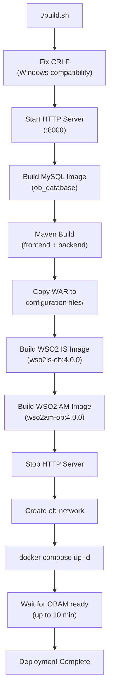

### Maven Build Detail

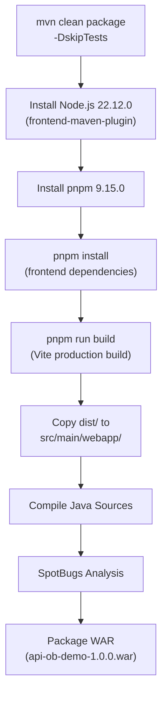

### Docker Image Build Process

Each WSO2 Docker image uses a **multi-stage build**:

**Stage 1**: Pull the pre-built accelerator image from `registry.wso2.com` and verify the accelerator directory exists.

**Stage 2**: Start from the base WSO2 product image, then:
1. Install bash and utilities.
2. Copy the accelerator from Stage 1.
3. Import keystores (private keys + public certificates).
4. Add the MySQL JDBC connector.
5. Remove stale accelerator artifacts, then merge new ones.
6. Download the deployment TOML configuration via the temporary HTTP server.
7. Import root and issuer CA certificates into the truststore.
8. Copy the demo application WAR (IS image only).
9. Fix hostname references (`localhost` -> `obiam`/`obam`).
10. Set file ownership and expose ports.

### Container Startup Order

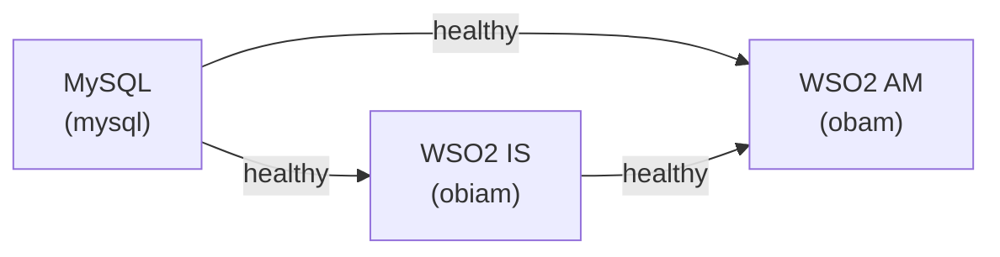

1. **MySQL** starts first. Health check: `mysqladmin ping`.
2. **OBIAM (IS)** starts after MySQL is healthy. Health check: IS login page responds.
3. **OBAM (AM)** starts after both MySQL and OBIAM are healthy. Health check: AM login page responds.

---

## Appendix: Technology Stack Summary

| Layer | Technology | Version |
|-------|-----------|---------|
| Frontend Framework | React | 19.2.0 |
| Frontend Build | Vite | 5.4.0 |
| UI Components | Material-UI | 5.18.0 |
| Auth Library | Asgardeo Auth React | 5.6.0 |
| Server State | TanStack React Query | 5.90.7 |
| Routing | React Router DOM | 7.9.5 |
| Charts | Chart.js | 4.5.1 |
| Forms | React Hook Form | 7.66.0 |
| Backend Language | Java | 11 |
| REST Framework | Apache CXF | 3.5.9 |
| JSON Library | Jackson | 2.15.2 |
| HTTP Client | Apache HttpComponents | 4.5.13 |
| Build Tool | Maven | 3.6+ |
| Identity Server | WSO2 IS | 7.1.0 |
| API Manager | WSO2 AM | 4.5.0 |
| OBIAM Accelerator | OBIAM | 4.0.0 |
| OBAM Accelerator | OBAM | 4.0.0 |
| Database | MySQL | 8.0 |
| Container Runtime | Docker | 20.10+ |
| Orchestration | Docker Compose | v2+ |
